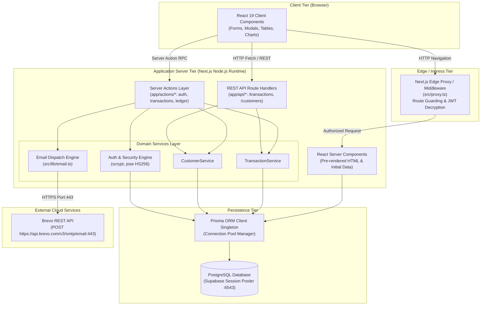
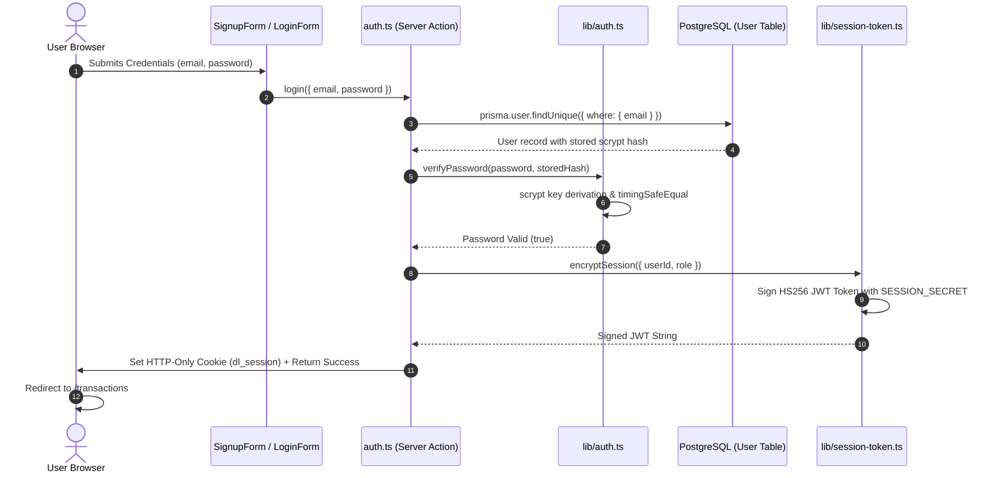
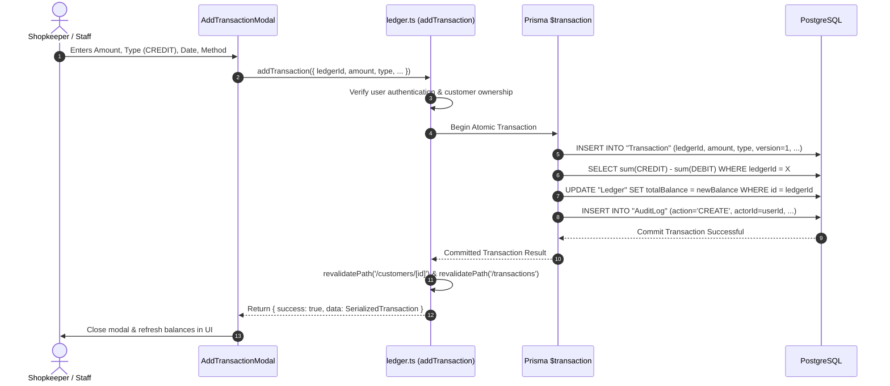
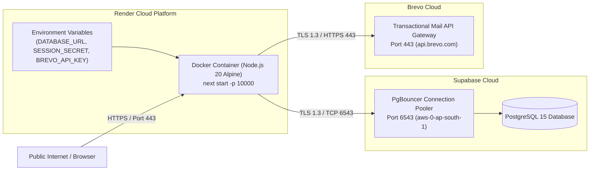

# High-Level Design (HLD)
## Digital Ledger & Customer Audit System (KhataBook)

**System Name:** Digital Ledger Architecture  
**Document Version:** 1.0.0  
**Author:** Engineering Team  
**Status:** In Production  
**Deployment:** Containerized Next.js on Render ([https://digital-ledger-tu7k.onrender.com](https://digital-ledger-tu7k.onrender.com))

---

## 1. System Architecture Overview

The Digital Ledger application is architected as a modern, unified, cloud-native full-stack application built on **Next.js App Router (Turbopack)**, **Prisma ORM**, **PostgreSQL**, and **Brevo HTTPS Email API**.



---

## 2. Layered Architecture & Subsystem Decomposition

### 2.1 Edge & Security Ingress Layer (`src/proxy.ts`)
- **Role:** First line of defense before any page or route handler is reached.
- **Responsibilities:**
  - Intercepts incoming requests and reads the `dl_session` cookie.
  - Decrypts the signed JSON Web Token (JWT) using `jose` without hitting the database.
  - Protects private routes (`/transactions`, `/customers`, `/dashboard`) by redirecting unauthenticated visitors to `/login?from=<path>`.
  - Automatically redirects authenticated users away from public auth pages (`/login`, `/signup`) to their dashboard.

### 2.2 Presentation & Hydration Layer (`src/app` & `src/components`)
- **React Server Components (RSC):** Render server-side with zero client JavaScript overhead. Pages like `app/transactions/page.tsx` fetch data directly via Prisma and stream pre-rendered HTML to the user with `initialData`.
- **React Client Components (`"use client"`):** Handle dynamic interactive state (filtering, modals, search query debouncing, CSV downloading, OTP timers).
- **URL-Synchronized State:** Search filters, date ranges, and pagination parameters are mirrored into the browser's URL search parameters (`?search=foo&page=2`), allowing browser history, bookmarks, and refresh operations to maintain state.

### 2.3 Application Layer: Server Actions vs REST API
The application intentionally maintains two interfaces into the domain model:
1. **Server Actions (`src/app/actions/*`):**
   - Direct Remote Procedure Calls (RPC) used by the internal Next.js React UI.
   - Eliminates client-side fetch boilerplate, manual serialization, and endpoint routing.
   - Executes securely in the Node.js runtime with direct access to cookies, headers, and database transactions.
2. **REST API Routes (`src/app/api/*`):**
   - Standard HTTP endpoints (`GET/POST /api/transactions`, `GET/POST /api/customers`, etc.).
   - Used for third-party integrations, automated contract test suites, external scripts, and mobile applications.
   - Adheres to standard HTTP status codes (`200`, `201`, `400`, `401`, `403`, `500`) and structured JSON error responses.

### 2.4 Domain Services Layer (`src/lib/services/*`)
- **`TransactionService`:** Encapsulates transaction validation, customer ownership verification, ledger balance recalculation, and audit log generation.
- **`CustomerService`:** Manages customer records, lifetime credit aggregation, and ledger initialization.
- **`Auth Engine (`src/lib/auth.ts`, `src/lib/session-token.ts`)`:** Manages scrypt password hashing, constant-time comparisons, and stateless JWT token lifecycles.
- **`Email Engine (`src/lib/email.ts`)`:** Formats responsive HTML email layouts and dispatches transactional emails via Brevo's HTTPS API.

### 2.5 Persistence Layer (`prisma/schema.prisma` & `src/lib/prisma.ts`)
- **ORM:** Prisma Client with generated TypeScript typings.
- **Connection Management:** Global singleton pattern (`globalThis.prisma`) prevents connection pool starvation across Next.js serverless and development reload cycles.
- **Database Engine:** PostgreSQL hosted on Supabase AWS pooler, supporting IPv4 pooler ports (`:6543`) with transaction pooling (`pgbouncer=true`).

---

## 3. Core Data Flow & Sequence Diagrams

### 3.1 Authentication & Session Issuance Flow


### 3.2 Transaction Recording & Atomic Balance Update Flow


---

## 4. Security Architecture

### 4.1 Multi-Tenant Data Isolation
Each shopkeeper operates as a completely isolated tenant. The database schema strictly enforces tenant boundaries:
$$\text{User} \xrightarrow{1:N} \text{Customer} \xrightarrow{1:1} \text{Ledger} \xrightarrow{1:N} \text{Transaction}$$
Every query in Server Actions and REST APIs verifies that the requested customer belongs to `session.userId`:
```typescript
const customer = await prisma.customer.findFirst({
  where: { id: customerId, userId: currentUser.id }
});
```
This mathematical guarantee prevents horizontal privilege escalation (IDOR attacks).

### 4.2 Credential Protection
- **Storage:** Passwords undergo scrypt hashing: $\text{scrypt}(\text{password}, \text{salt}_{16\text{ bytes}}, N=16384, r=8, p=1, \text{keylen}=64)$.
- **Verification:** Candidates are evaluated via Node.js `crypto.timingSafeEqual` in constant execution time.
- **Session Tokens:** Decoupled from persistent database state; cryptographically signed with HMAC-SHA256 (`HS256`) and stored in non-JavaScript-accessible (`httpOnly`) cookies.

### 4.3 Zero-SMTP Cloud Policy
Render and modern cloud containers block outbound connections on ports 25, 465, and 587. To ensure 100% email delivery uptime, the system routes all OTPs over HTTPS:
$$\text{Next.js Container} \xrightarrow[\text{Port 443}]{\text{HTTPS POST}} \text{https://api.brevo.com/v3/smtp/email}$$
No SMTP ports are ever opened, eliminating connection timeouts (`ETIMEDOUT`).

---

## 5. Deployment & Infrastructure Architecture



- **Runtime:** Node.js 20 on Linux Alpine (`standalone` Next.js distribution).
- **Port:** Configured via `PORT=10000` (Render's internal container port).
- **Static Asset Serving:** Cached with immutable headers via Next.js internal static optimizer.
