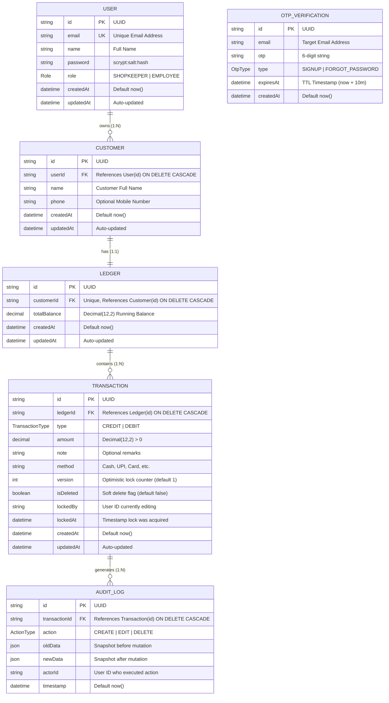
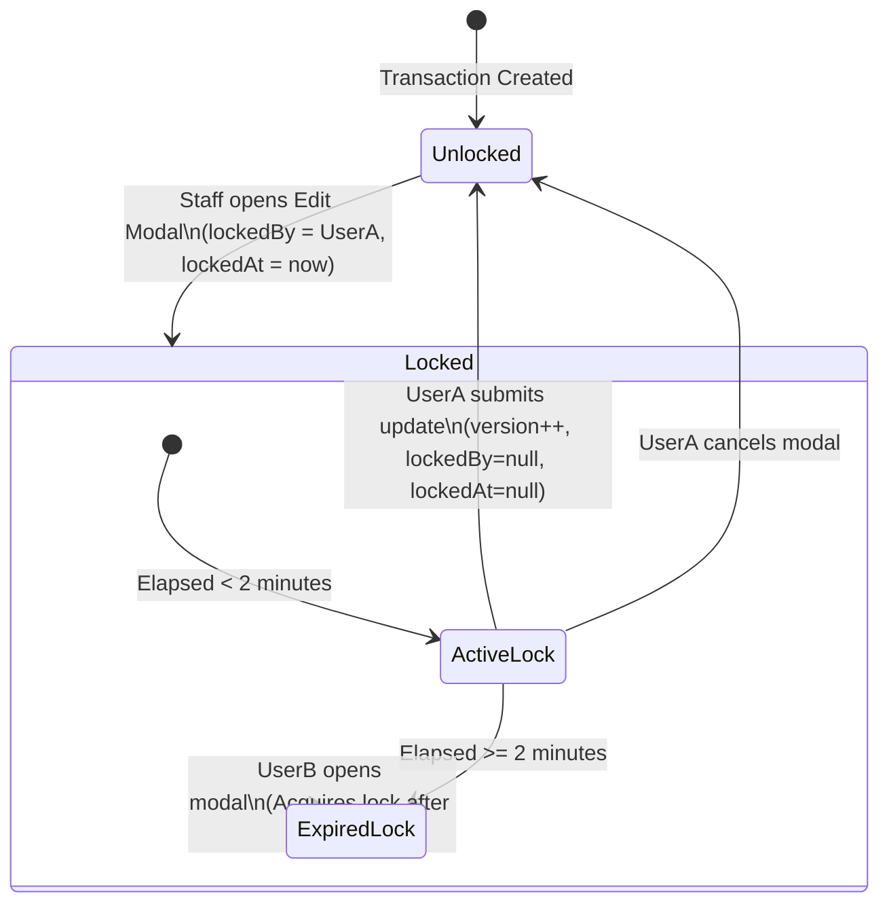

# Low-Level Design (LLD)
## Digital Ledger & Customer Audit System (KhataBook)

**System Name:** Digital Ledger Component & Data Specifications  
**Document Version:** 1.0.0  
**Status:** In Production  
**Target Platform:** Next.js 16 (Turbopack) / PostgreSQL / Node.js 20

---

## 1. Data Models & Entity-Relationship (ER) Specification



---

## 2. Mathematical Invariants & Financial Arithmetic

### 2.1 Balance Formula
For any given customer ledger $L$, the running `totalBalance` represents net credit owed by the customer (receivable):
$$\text{totalBalance} = \sum_{t \in T, t.\text{isDeleted}=\text{false}} \text{SignedAmount}(t)$$

Where:
$$\text{SignedAmount}(t) = \begin{cases} +t.\text{amount} & \text{if } t.\text{type} = \text{CREDIT} \quad (\text{Goods/money given on credit}) \\ -t.\text{amount} & \text{if } t.\text{type} = \text{DEBIT} \quad (\text{Customer repayment received}) \end{cases}$$

### 2.2 Monetary Rounding Rule
All monetary values are rounded using banker's precision to two decimal places:
$$\text{roundMoney}(x) = \frac{\operatorname{round}(x \times 100)}{100}$$
In PostgreSQL, this is enforced by column definitions using `@db.Decimal(12, 2)`, preventing floating-point rounding drifts common in JavaScript IEEE 754 arithmetic.

---

## 3. Concurrency & Optimistic Locking Mechanism

To prevent conflicting updates when multiple staff members view or edit the same transaction simultaneously:



### 3.1 Lock Acquisition Rules:
1. When a user opens the edit modal, `acquireTransactionLock(txId)` checks:
   - If `lockedBy == null` OR `lockedAt < (now - 2 minutes)`, grant lock.
   - If `lockedBy != null` AND `lockedAt >= (now - 2 minutes)` AND `lockedBy != currentUserId`, deny lock with `"CONCURRENT_EDIT"` warning.
2. Upon saving:
   - The SQL update specifies `WHERE id = :id AND version = :expectedVersion`.
   - If 0 rows updated, an optimistic concurrency collision occurred; the mutation aborts with an error prompting the user to reload.

---

## 4. Subsystem & Module Specifications

### 4.1 Authentication Engine (`src/lib/auth.ts` & `src/lib/session-token.ts`)
```typescript
// 1. Password Hashing Specification
hashPassword(password: string): Promise<string>
// Uses Node.js crypto.scrypt:
// Salt: crypto.randomBytes(16)
// Key length: 64 bytes
// Stored format: "scrypt:<salt_hex>:<derived_hex>"

// 2. Timing-Safe Verification
verifyPassword(password: string, stored: string): Promise<boolean>
// Uses crypto.timingSafeEqual(derivedBuffer, storedBuffer)

// 3. JWT Session Encryption
encryptSession(payload: { userId: string; role: Role }): Promise<string>
// Algorithm: HS256 via 'jose' library
// Secret: Process environment SESSION_SECRET
// Expiry: 7 days ("7d")
// Stored in: Cookie "dl_session" with HttpOnly, Secure, SameSite=Lax
```

### 4.2 Email Dispatch Subsystem (`src/lib/email.ts`)
```typescript
sendOtpEmail(params: {
  to: string;
  otp: string;
  purpose: "SIGNUP" | "FORGOT_PASSWORD";
}): Promise<{ success: boolean; error?: string }>
```
**Execution Rules:**
1. Verifies `process.env.BREVO_API_KEY` is present.
2. Resolves verified sender from `process.env.BREVO_SENDER_EMAIL` and `process.env.BREVO_SENDER_NAME`.
3. If sender email is missing, returns configuration error immediately without attempting network connection.
4. Executes HTTP `fetch()` call:
   - **Method:** `POST`
   - **URL:** `https://api.brevo.com/v3/smtp/email` (Port 443 HTTPS)
   - **Headers:** `api-key: <BREVO_API_KEY>`, `Content-Type: application/json`
   - **Body:**
     ```json
     {
       "sender": { "name": "TallyHo", "email": "tallyh29@gmail.com" },
       "to": [{ "email": "user@example.com" }],
       "subject": "[KhataBook] 123456 is your verification code",
       "htmlContent": "<!DOCTYPE html>..."
     }
     ```
5. Handles status codes:
   - `201 Created`: Success.
   - `401 / 400`: Parses error message without leaking the API key to client responses.

### 4.3 OTP Verification Engine (`src/lib/otp.ts`)
```typescript
generateAndSendOtp(email: string, type: "SIGNUP" | "FORGOT_PASSWORD"): Promise<{ success: boolean; error?: string }>
verifyAndConsumeOtp(email: string, otp: string, type: "SIGNUP" | "FORGOT_PASSWORD"): Promise<{ valid: boolean; error?: string }>
```
- **Code Generation:** Cryptographically secure 6-digit string using `crypto.randomInt(100000, 999999).toString()`.
- **TTL Window:** 10 minutes (`new Date(Date.now() + 10 * 60 * 1000)`).
- **Consumption:** Once validated, the row is deleted immediately (`prisma.otpVerification.deleteMany(...)`) to prevent replay attacks.

---

## 5. API Interface Contract Specifications

### 5.1 POST `/api/transactions`
Creates a financial entry and updates the customer ledger.

**Request Headers:**
```http
Content-Type: application/json
x-shopkeeper-id: <shopkeeper-uuid> (or dl_session cookie)
```

**Request Body Schema:**
```json
{
  "ledgerId": "c394d21e-5a02-4f7b-9671-8812c3f81e9b",
  "type": "CREDIT",
  "amount": 1500.50,
  "date": "2026-09-16T08:30:00.000Z",
  "paymentMethod": "Cash",
  "note": "Wholesale rice bag purchase"
}
```

**Response (201 Created):**
```json
{
  "success": true,
  "data": {
    "id": "7b2c9d1a-4e8f-4311-b1e0-d09f7a812345",
    "ledgerId": "c394d21e-5a02-4f7b-9671-8812c3f81e9b",
    "type": "CREDIT",
    "amount": 1500.50,
    "date": "2026-09-16T08:30:00.000Z",
    "paymentMethod": "Cash",
    "note": "Wholesale rice bag purchase",
    "version": 1,
    "isDeleted": false,
    "createdAt": "2026-09-16T08:30:00.000Z",
    "updatedAt": "2026-09-16T08:30:00.000Z"
  }
}
```

**Error Response (403 Forbidden):**
```json
{
  "success": false,
  "error": {
    "code": "FORBIDDEN",
    "message": "Customer does not belong to current user"
  }
}
```

---

### 5.2 GET `/api/transactions`
Retrieves paginated transactions with optional filtering.

**Query Parameters:**
- `page` (integer, default `1`): Current page number.
- `limit` (integer, default `10`, max `100`): Rows per page.
- `search` (string, optional): Substring search against customer names.
- `type` (`CREDIT` | `DEBIT`, optional): Filter by transaction category.
- `dateFrom`, `dateTo` (ISO-8601 string, optional): Bounding date filters.

**Response (200 OK):**
```json
{
  "success": true,
  "data": {
    "transactions": [ ... ],
    "pagination": {
      "currentPage": 1,
      "pageSize": 10,
      "totalRecords": 84,
      "totalPages": 9,
      "hasNextPage": true,
      "hasPrevPage": false
    },
    "summary": {
      "totalCredit": 45200.00,
      "totalDebit": 21850.00,
      "netBalance": 23350.00
    }
  }
}
```

---

## 6. Directory Layout & Source Map

```
digital-ledger/
├── docs/
│   ├── PRD.md                       # Product Requirements Document
│   ├── HLD.md                       # High-Level Architecture Design
│   ├── LLD.md                       # Low-Level Component & Data Design
│   └── api-contract-transactions.md # Transactions API Interface Contract
├── prisma/
│   └── schema.prisma                # PostgreSQL schema & model declarations
├── src/
│   ├── proxy.ts                     # Edge middleware route guard & JWT parser
│   ├── app/
│   │   ├── actions/                 # Next.js Server Actions (RPC layer)
│   │   │   ├── auth.ts              # Signup, login, OTP dispatch & verification
│   │   │   ├── customers.ts         # Customer creation & directory queries
│   │   │   ├── ledger.ts            # Ledger balance mutations & audit logging
│   │   │   └── transactions.ts      # Cross-customer transaction streams
│   │   ├── api/                     # REST API route handlers
│   │   │   ├── customers/route.ts   # GET & POST customers
│   │   │   └── transactions/        # GET & POST transactions & invoices
│   │   ├── customers/               # Customer directory & statement pages
│   │   ├── transactions/            # Global transaction feed page
│   │   └── (auth)/                  # /login, /signup, /forgot-password
│   ├── components/                  # React 19 Client Components
│   │   ├── auth/                    # LoginForm, SignupForm, ForgotPasswordForm
│   │   ├── customers/               # CustomersDirectory, AddCustomerModal
│   │   └── transactions/            # TransactionsDashboard, TransactionRow
│   └── lib/                         # Core domain logic & utilities
│       ├── auth.ts                  # scrypt password hashing & session helpers
│       ├── email.ts                 # Brevo HTTPS transactional email delivery
│       ├── otp.ts                   # Ephemeral OTP generation & TTL checks
│       ├── prisma.ts                # PrismaClient global singleton
│       ├── session-token.ts         # jose HS256 JWT encryption/decryption
│       └── services/                # TransactionService & CustomerService
└── test/
    └── brevo-email.test.ts          # Brevo email unit & contract test suite
```
